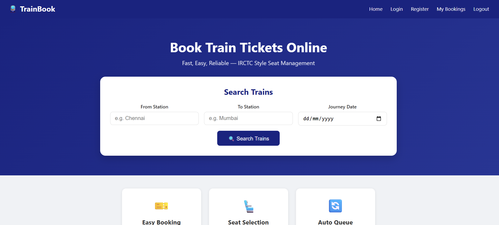
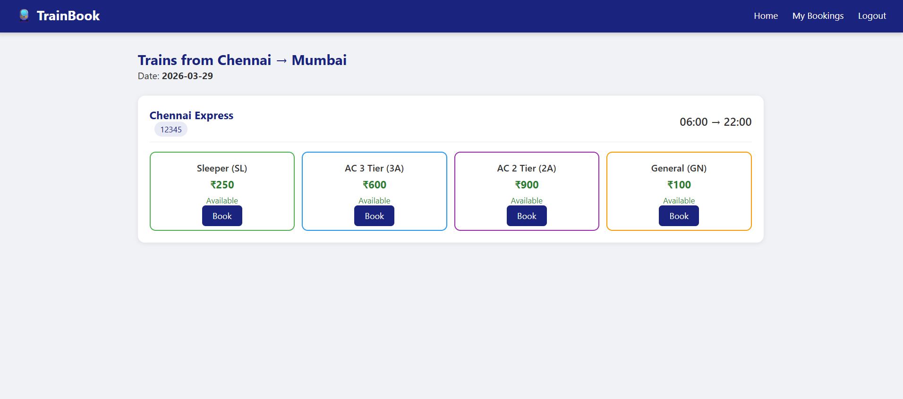
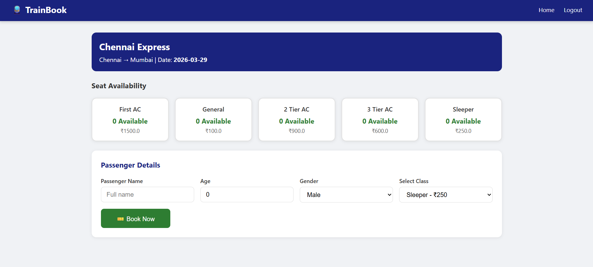
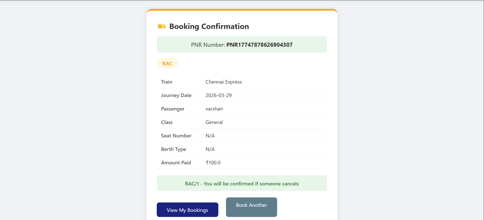
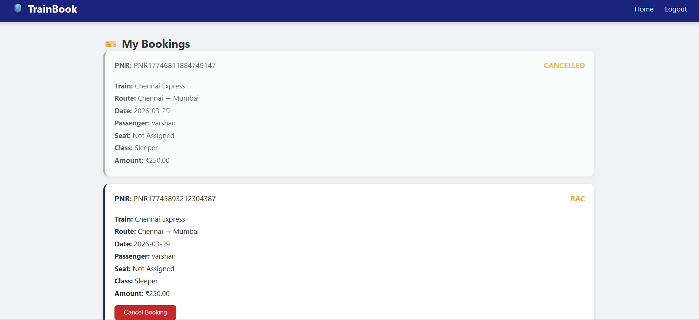
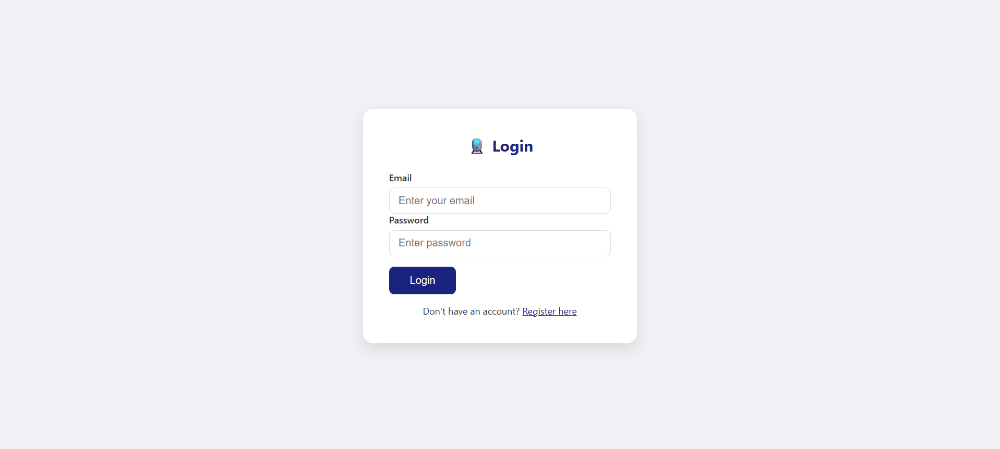
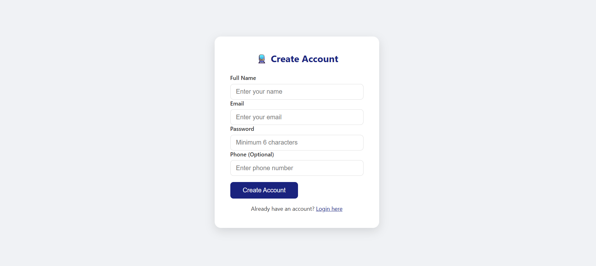

# 🚆 Train Ticket Reservation System

An **IRCTC-style Train Reservation System** built with Spring Boot,
featuring complete seat management with Confirmed, RAC, and Waiting
List allocation logic — just like the real Indian Railway system!

🔗 **Live Demo:** [http://YOUR_ORACLE_CLOUD_IP:8080](http://YOUR_ORACLE_CLOUD_IP:8080)
📁 **GitHub:** [https://github.com/appasamy2004/train-reservation](https://github.com/appasamy2004/train-reservation)

---

## 📸 Screenshots

### 🏠 Home Page


### 🔍 Search Trains


### 💺 Seat Selection


### 🎫 Booking Confirmation


### 📋 My Bookings


### 🔐 Login Page


### 📝 Register Page


---

## ✨ Features

- 🔍 **Train Search** — Search trains by source, destination and date
- 🎫 **Smart Booking** — Confirmed / RAC / Waiting List allocation
- 🔄 **Auto Queue Promotion** — RAC → Confirmed, WL → RAC on cancellation
- 🔐 **Secure Authentication** — Spring Security + BCrypt encryption
- 👤 **Role Based Access** — USER and ADMIN roles
- 📋 **My Bookings** — View and cancel your bookings
- ⏰ **Auto Reset Scheduler** — Resets past journey seats at midnight
- 🌐 **Deployed on Oracle Cloud** — Live 24/7 always free

---

## 🛠️ Tech Stack

| Layer | Technology |
|---|---|
| **Backend** | Java 17, Spring Boot 3.2 |
| **Security** | Spring Security, BCrypt |
| **ORM** | Hibernate, Spring Data JPA |
| **Database** | MySQL 8 |
| **Frontend** | Thymeleaf, HTML5, CSS3 |
| **Build Tool** | Maven |
| **Deployment** | Oracle Cloud Always Free VM |

---

## 🗄️ Database Schema
```
users
  └── bookings (many)
        └── seats (one)
        └── train_schedules (one)
              └── trains (one)
                    └── seats (many)
```

**5 Tables:**
- `users` — registered passengers and admins
- `trains` — train details (name, route, timings)
- `train_schedules` — train running on specific dates
- `seats` — individual seats per schedule
- `bookings` — ticket bookings with PNR

---

## 🚀 How to Run Locally

### Prerequisites

Make sure you have these installed:
- ✅ Java 17 or higher
- ✅ Maven 3.6+
- ✅ MySQL 8.0+
- ✅ IntelliJ IDEA (recommended)

---

### Step 1 — Clone the Repository
```bash
git clone https://github.com/appasamy2004/train-reservation.git
cd train-reservation
```

---

### Step 2 — Create MySQL Database

Open MySQL Workbench or MySQL CLI and run:
```sql
CREATE DATABASE IF NOT EXISTS train_reservation;
USE train_reservation;
```

> Hibernate will automatically create all tables when you run the app!

---

### Step 3 — Configure Database

Open `src/main/resources/application.properties` and update:
```properties
spring.datasource.url=jdbc:mysql://localhost:3306/train_reservation?useSSL=false&serverTimezone=UTC&allowPublicKeyRetrieval=true
spring.datasource.username=root
spring.datasource.password=YOUR_MYSQL_PASSWORD
```

Replace `YOUR_MYSQL_PASSWORD` with your actual MySQL password.

---

### Step 4 — Run the Application

**Option A — Using IntelliJ:**
1. Open the project in IntelliJ IDEA
2. Find `TrainReservationApplication.java`
3. Right click → **Run**

**Option B — Using Maven:**
```bash
mvn spring-boot:run
```

**Option C — Using JAR:**
```bash
mvn clean package -DskipTests
java -jar target/TrainReservationSystem-0.0.1-SNAPSHOT.jar
```

---

### Step 5 — Add Sample Data

Once app is running, connect to MySQL and run:
```sql
USE train_reservation;

-- Insert trains
INSERT INTO trains (train_number, train_name, source_station,
dest_station, departure_time, arrival_time, total_distance)
VALUES
('12345', 'Chennai Express', 'Chennai', 'Mumbai',
 '06:00:00', '22:00:00', 1300),
('67890', 'Rajdhani Express', 'Delhi', 'Mumbai',
 '16:00:00', '08:00:00', 1400);

-- Insert schedules for next 5 days
INSERT INTO train_schedules
(train_id, journey_date, ac_capacity, sleeper_capacity,
 general_capacity, rac_capacity, status)
VALUES
(1, CURDATE() + INTERVAL 1 DAY, 50, 100, 150, 10, 'SCHEDULED'),
(1, CURDATE() + INTERVAL 2 DAY, 50, 100, 150, 10, 'SCHEDULED'),
(1, CURDATE() + INTERVAL 3 DAY, 50, 100, 150, 10, 'SCHEDULED'),
(2, CURDATE() + INTERVAL 1 DAY, 50, 100, 150, 10, 'SCHEDULED'),
(2, CURDATE() + INTERVAL 2 DAY, 50, 100, 150, 10, 'SCHEDULED'),
(2, CURDATE() + INTERVAL 3 DAY, 50, 100, 150, 10, 'SCHEDULED');
```

---

### Step 6 — Open in Browser
```
http://localhost:8080
```

---

## 📱 How to Use

1. **Register** — Create a new account at `/register`
2. **Login** — Login with your email and password
3. **Search** — Enter source, destination and date on home page
4. **Book** — Click Book on any train → fill passenger details → Book Now
5. **View** — Go to My Bookings to see all your tickets
6. **Cancel** — Click Cancel Booking to cancel and auto-promote queue

---

## 📁 Project Structure
```
src/
└── main/
    ├── java/com/trainreservation/
    │   ├── TrainReservationApplication.java
    │   ├── config/
    │   │   ├── SecurityConfig.java
    │   │   └── CustomUserDetails.java
    │   ├── controller/
    │   │   ├── TrainController.java
    │   │   ├── BookingController.java
    │   │   ├── SeatController.java
    │   │   └── UserController.java
    │   ├── service/
    │   │   ├── TrainService.java
    │   │   ├── BookingService.java
    │   │   ├── SeatService.java
    │   │   └── UserService.java
    │   ├── repository/
    │   │   ├── TrainRepository.java
    │   │   ├── TrainScheduleRepository.java
    │   │   ├── SeatRepository.java
    │   │   ├── BookingRepository.java
    │   │   └── UserRepository.java
    │   ├── entity/
    │   │   ├── User.java
    │   │   ├── Train.java
    │   │   ├── TrainSchedule.java
    │   │   ├── Seat.java
    │   │   └── Booking.java
    │   ├── dto/
    │   │   ├── BookingRequest.java
    │   │   ├── BookingResponse.java
    │   │   ├── SeatAvailabilityDTO.java
    │   │   └── UserRegistrationDTO.java
    │   ├── enums/
    │   │   ├── SeatType.java
    │   │   ├── BerthType.java
    │   │   └── SeatStatus.java
    │   └── scheduler/
    │       └── JourneyResetScheduler.java
    └── resources/
        ├── application.properties
        ├── templates/
        │   ├── index.html
        │   ├── login.html
        │   ├── register.html
        │   ├── search.html
        │   ├── seat-selection.html
        │   ├── booking-confirm.html
        │   └── my-bookings.html
        └── static/
            └── css/
                └── style.css
```

---

## 🔑 Booking Logic
```
User books a ticket
        ↓
Seat available?
   YES → CONFIRMED ✅ (seat assigned)
   NO  → RAC capacity left?
              YES → RAC 🟡 (shared berth)
              NO  → WAITING LIST 🔴 (no seat)

User cancels?
        ↓
RAC/1 → CONFIRMED (gets the freed seat)
WL/1  → RAC (moves up the queue)
WL/2 becomes WL/1 (renumbered)
```

---

## 👨‍💻 Author

**Appasamy M**
- 📧 appasamyarun715@gmail.com
- 🔗 [LinkedIn](https://linkedin.com/in/yourprofile)
- 💻 [GitHub](https://github.com/appasamy2004)
- 🏆 [LeetCode](https://leetcode.com/yourprofile)

---

## 📄 License

This project is open source and available under the
[MIT License](LICENSE).